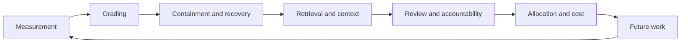

# Engineering Reliable Coding Agents

*Evaluating and Operating the System Around the Model*

Coding agents are evaluated as models but deployed as systems. Once work can outlive a worker, mutate shared code, call external systems, run concurrently, or require durable recovery, reliability belongs to the system around the model.

This repository contains the technical review and engineering monograph, runnable reliability and evaluation protocols, a machine-readable evidence and practice catalog, and reusable agent skills derived from selected practices. Each system layer determines what the next may trust. Downstream confidence cannot repair evidence lost upstream.

[Read the browser edition](https://sjarmak.ai/books/engineering-reliable-coding-agents) · [Run the minimum reliability pass](protocols/minimum-reliability-pass.md) · [Browse the companion catalog](https://sjarmak.ai/books/engineering-reliable-coding-agents/companion) · [Inspect the research artifact](companion/README.md)

## Start with your problem

| Problem | Start here | Result produced |
| --- | --- | --- |
| I need to compare two agent systems or configurations | [Evaluation comparison protocol](protocols/evaluation-comparison.md) and [Chapters 1–3](editing/engineering-reliable-coding-agents.md#run-to-run-variance-statistical-power-and-paired-comparisons) | Paired comparison with uncertainty and a predeclared decision rule |
| I need the smallest credible reliability program | [Minimum reliability pass](protocols/minimum-reliability-pass.md) | Six inspectable artifacts tied to one system revision |
| I need to know whether an agent has excessive authority | [Authority-boundary test](protocols/authority-boundary-test.md) and [Chapter 8](editing/engineering-reliable-coding-agents.md#agent-isolation-injection-defenses-and-independent-verification) | Denied ordinary action, bounded escalation, and authority inventory |
| I need to test crash, retry, or duplicate-effect behavior | [Recovery fault-injection protocol](protocols/recovery-fault-injection.md) and [Chapters 9–10](editing/engineering-reliable-coding-agents.md#persistent-agent-state-durable-workflows-and-idempotent-retries) | Fault result tied to a named kill point and invariant |
| I need to explain why runs fail | [Failure-trace review](protocols/failure-trace-review.md) and [Chapter 11](editing/engineering-reliable-coding-agents.md#human-auditable-failure-analysis-and-taxonomy-development) | Reproducible upstream attribution or an explicit observability gap |
| I need to evaluate routing, topology, or fleet allocation | [Allocation-policy replay](protocols/allocation-policy-replay.md) and [Chapters 18–19](editing/engineering-reliable-coding-agents.md#agent-topology-selection-and-dynamic-task-allocation) | Fixed-arrival replay against a named baseline |
| I need a practice related to a specific failure | [Companion catalog](companion/catalog.json) | Evidence-scoped practice records and neighboring alternatives |
| I need reusable agent workflows | [Skills collection](skills/) | Installable operational workflows with evidence maps |

## The system model in one minute



Five distinctions prevent many failures from being assigned to the wrong component:

1. Logical work is not an execution attempt.
2. A lease or heartbeat is not write authority.
3. A candidate artifact is not accepted completion.
4. A local completion record is not an external commitment.
5. Verifier output is not semantic truth.

[Chapter 7](editing/engineering-reliable-coding-agents.md#the-software-factory-as-a-distributed-system) develops this factory model, the conditions under which it is useful, and the contracts that make the distinctions operational.

## Start in ten minutes

From a clean clone, scaffold the retained records for the minimum pass:

```bash
git clone https://github.com/sjarmak/engineering-reliable-coding-agents.git
cd engineering-reliable-coding-agents
node scripts/new-protocol-run.mjs minimum-reliability-pass ./runs/my-agent
```

The dependency-free command creates `manifest.json` and six empty control records for repeated runs, outcome verification, the authority boundary, interrupted-run recovery, failure-trace review, and cost/time comparison. It records the current Git revision by default; when the evaluated system is a different checkout, pass its immutable identity with `--revision <revision>` before collecting results.

Open `runs/my-agent/manifest.json`, record `task_family`, `model`, `harness_revision`, and `tool_policy_revision`, then execute the six steps in the [minimum reliability pass](protocols/minimum-reliability-pass.md). Every generated record starts as `not-run`. The scaffold records no evidence. A completed pass establishes only that the six controls produced inspectable records for the named system revision. Do not average a failed control away with the other five.

For a narrower decision, choose one of the protocols in the table above. Each protocol states the decision it supports, required procedure, local pass condition, retained artifact, and the result it cannot establish without additional evidence. [`protocols/README.md`](protocols/README.md) provides the complete index and stable practice mappings.

## Know what a claim establishes

Release `1.0.0` synthesizes 164 scholarly works, 100 practitioner records, 29 benchmark records, and 17 author-system case records. Its catalog contains 206 bounded practice records: 56 are developed in the manuscript and 150 are companion-only entries. Those are catalog counts, not estimates of how many reliability practices exist.

| Label | What it can establish | What it does not establish |
| --- | --- | --- |
| `strong` | Direct support for the scoped claim through a controlled comparison, validated benchmark result, or comparably specific measurement | Universal transfer beyond the measured workload and system |
| `directional` | Support for a mechanism or direction worth testing locally | A general effect size or deployment threshold |
| `corroborating` | Plausibility through a case or convergent observation | An independently measured causal result |
| `null_or_conflicting` | A failed expectation, boundary, or conflict that constrains another claim | Proof that the mechanism never works |
| `author_system_illustration` | A local measurement or failure case from a system operated by the author | Independent external evidence or a general recommendation |
| Catalog-level lead | A thin-support mechanism preserved for investigation | A recommended best practice |

A **developed practice** receives chapter-level treatment of its mechanism, evidence, and boundary. A **companion entry** is intentionally more compact; some extend a chapter and some are thin-support leads. Neither label upgrades its evidence group. Part VI adapts scheduling, distributed-systems, and topology mechanisms from adjacent domains into testable designs. Treat a mechanism as a measured coding-agent effect only when its record reports such a measurement.

Every practice record carries a stable `ERCA-NNN` identifier, after the initials of this book's title, and the same number names that record in the chapters, the companion files, the protocols, and the skills. Use [`companion/catalog.json`](companion/catalog.json) to resolve one, along with practice-level evidence and limitations; [`companion/evidence-ledger.csv`](companion/evidence-ledger.csv) for claim-to-source links, [`companion/chapter-crosswalk.json`](companion/chapter-crosswalk.json) for treatment and chapter placement, and [`companion/benchmark-catalog.json`](companion/benchmark-catalog.json) for benchmark records. The [provenance statement](companion/PROVENANCE.md) describes what the public artifact includes and excludes.

## Read or reuse more

- [Editable browser-oriented manuscript](editing/engineering-reliable-coding-agents.md): the complete monograph in one Markdown file, mapped back to canonical TeX source.
- [Canonical manuscript source](manuscript/main.tex): the release source of truth.
- [Factory contracts](protocols/factory-contracts.yaml): machine-readable contracts I1–I11 and their checks.
- [Distributed ambiguity faults](protocols/distributed-ambiguity-faults.yaml): fault cases for disagreement across components.
- [Figure sources](assets/): one self-contained SVG per figure, rendered to `manuscript/figures/` by `node scripts/build-figures.mjs`. The source-review figure's corpus and practice counts are checked against companion data.
- [Practice catalog index](manuscript/appendix-practices.tex): the in-book appendix generated from `companion/catalog.json` by `node scripts/build-practice-appendix.mjs`, which every `ERCA-NNN` in the manuscript links to.
- [Skills manifest](skills/manifest.json): five derived workflows and their evidence boundary.
- [Release metadata](release-metadata.json): authoritative version, freeze, license, and methodology-gate state.

The manuscript and companion are released under CC-BY-4.0; scripts, protocols, skills, and repository metadata are Apache-2.0. See [`LICENSE-SCOPE.md`](LICENSE-SCOPE.md) for the directory-level terms and [`CITATION.cff`](CITATION.cff) for citation metadata.

## Verify the release artifact

Run the checks that do not require the digest-pinned TeX container:

```bash
python3 scripts/check_release_counts.py
python3 scripts/check_release_counts.test.py
node --test scripts/new-protocol-run.test.mjs
(cd companion && sha256sum -c SHA256SUMS)
```

The full release gate validates packaged archives and recompiles the arXiv source offline; see [`SUBMISSION.md`](SUBMISSION.md#companion-release-sequence) for that release-maintainer workflow.
